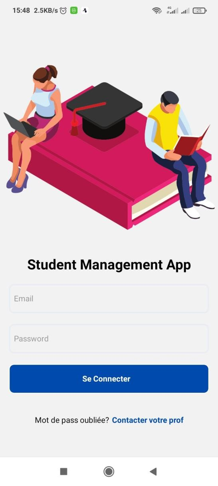
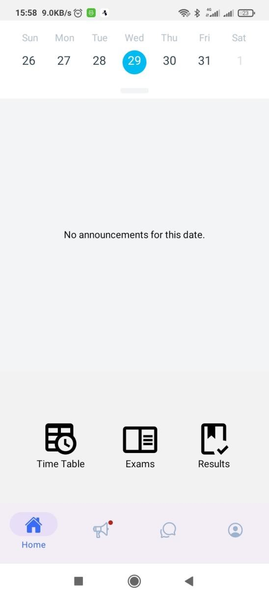
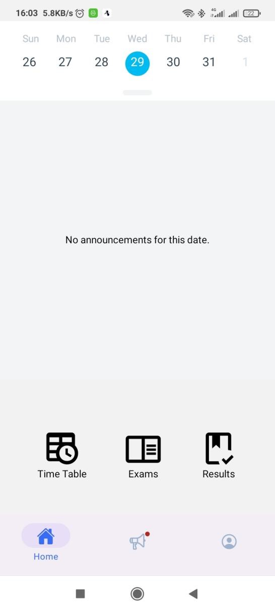
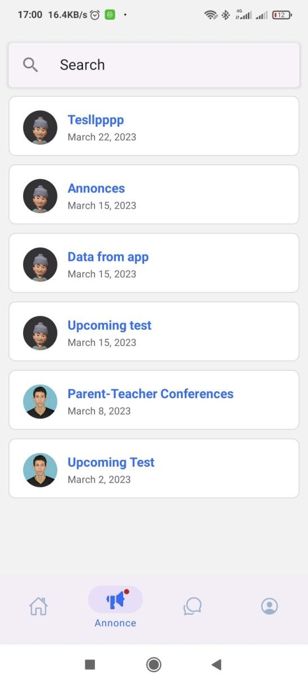
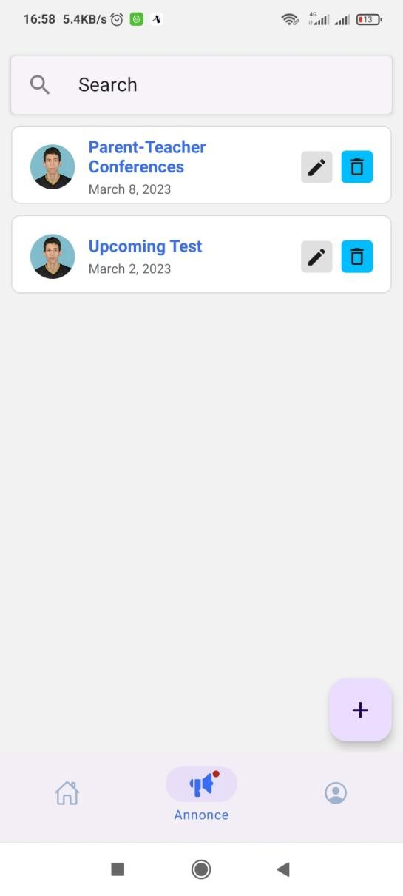
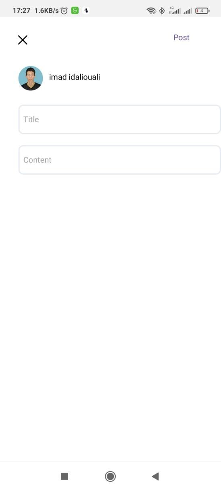
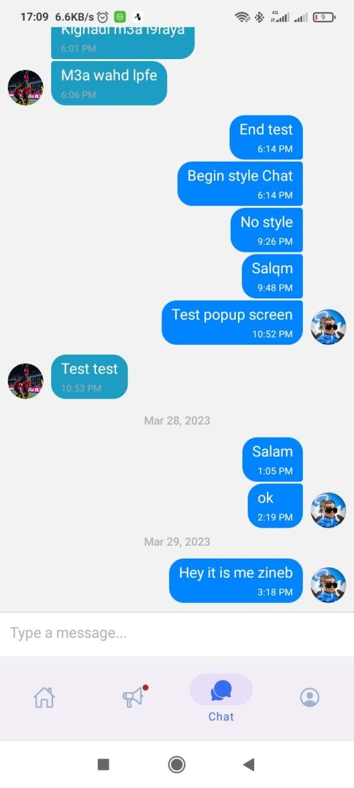
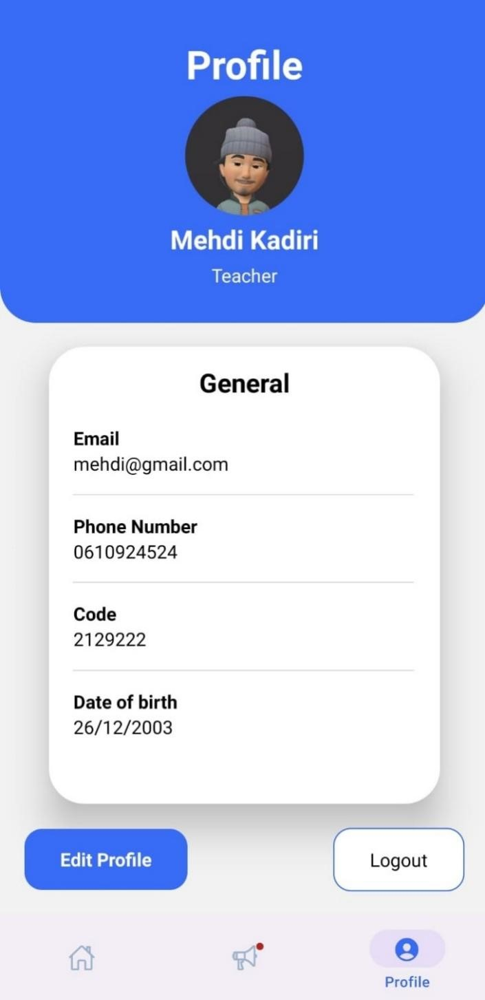
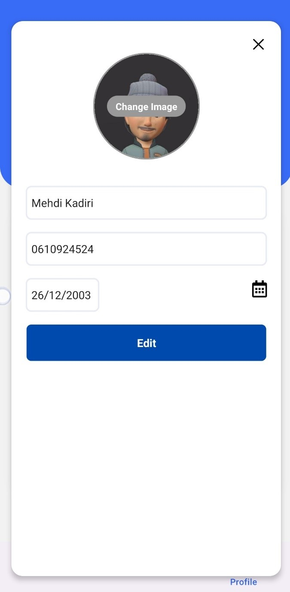

# Application mobile de gestion des étudiants

## Contributors :

<li><a href='https://www.github.com/MehKad'>Kadiri Mehdi</a></li>
<li><a href='https://github.com/ImadIdaliouali'>Idaliouali Imad</a></li>

<br>

## Project Informations :

A mobile app created using a javaScript framework : React-Native, the goal from the app is to facilittate to students access to their personal information, edit them, and we decided aswell to impliment the time table and exams schedual depending on their filiere, as well as each students results.

A chat page was also made for to easiate the communication between students from the same filiere.

We make this projects for teachers as well, where they can write, edit, and remove posts for their students, as well as to see their personal data.

<br>

# UI

## login



## Home page

<li>Students : </li>



<li>Teacher : </li>



## Annonces / Posts

<li>Students : </li>



<li>Teacher : </li>




## Chat



## Profile




# Get it yourself :

After cloning the project, run the folowing commande :

```
npm install
```

or

```
npm i
```

then you can run the following :

```
expo start
```

or

```
npx expo start
```

then download the expo app from playstore or appstore, and scan the folowing qr code.

# The users :

## Teacher :

<li>Teacher 1 : mehdi@gmail.com azerty</li>
<li>Teacher 2 : imad@gmail.com 12345</li>
<br>

## Students :

<li>Student 1 : test@gmail.com test12</li>
<li>Student 2 : test2@gmail.com test12</li>
<li>Student 3 : test3@gmail.com test12</li>
